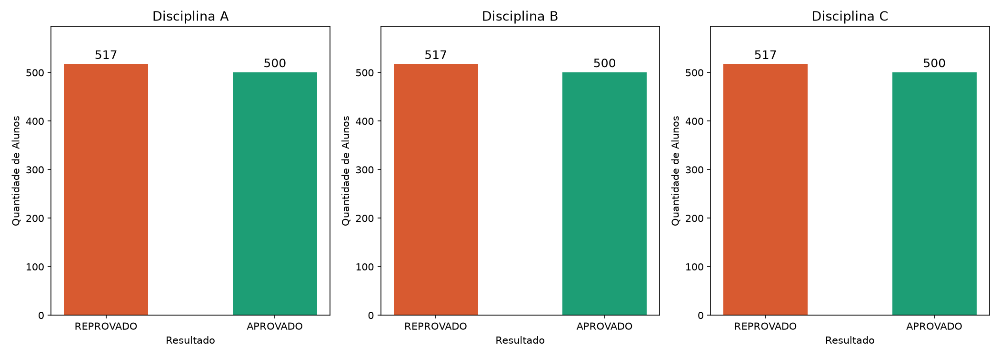
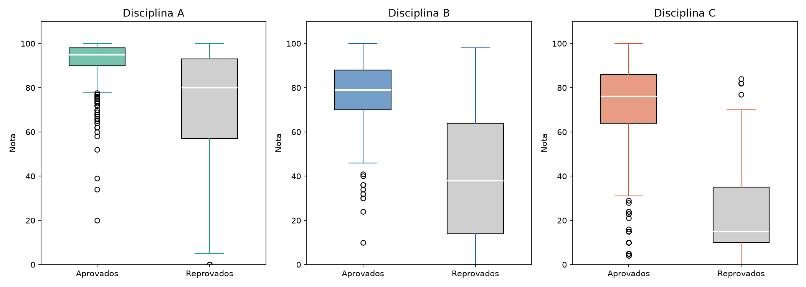
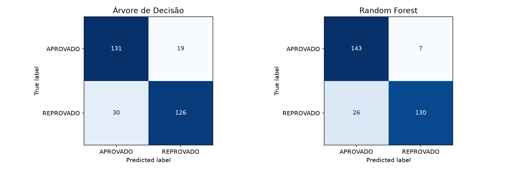
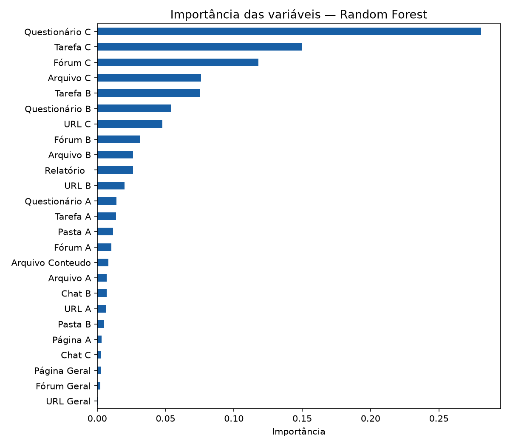
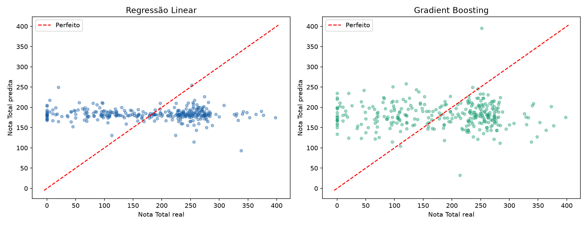
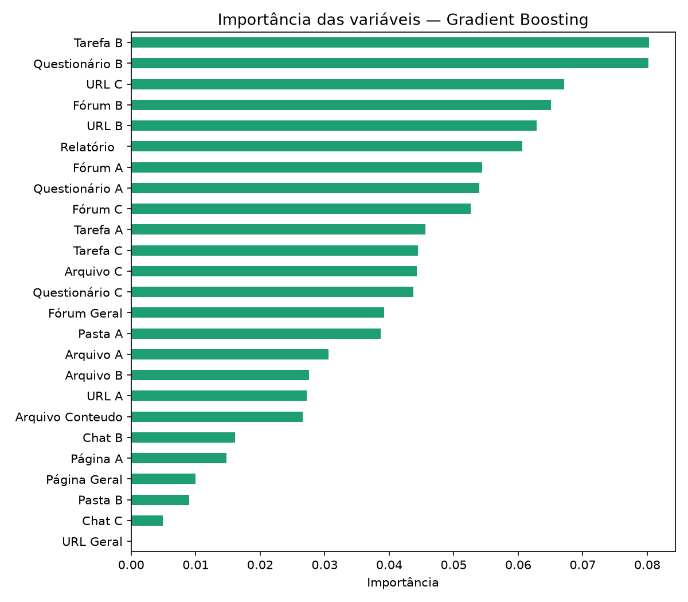
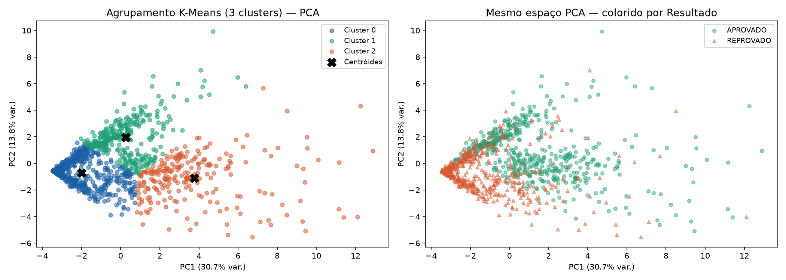
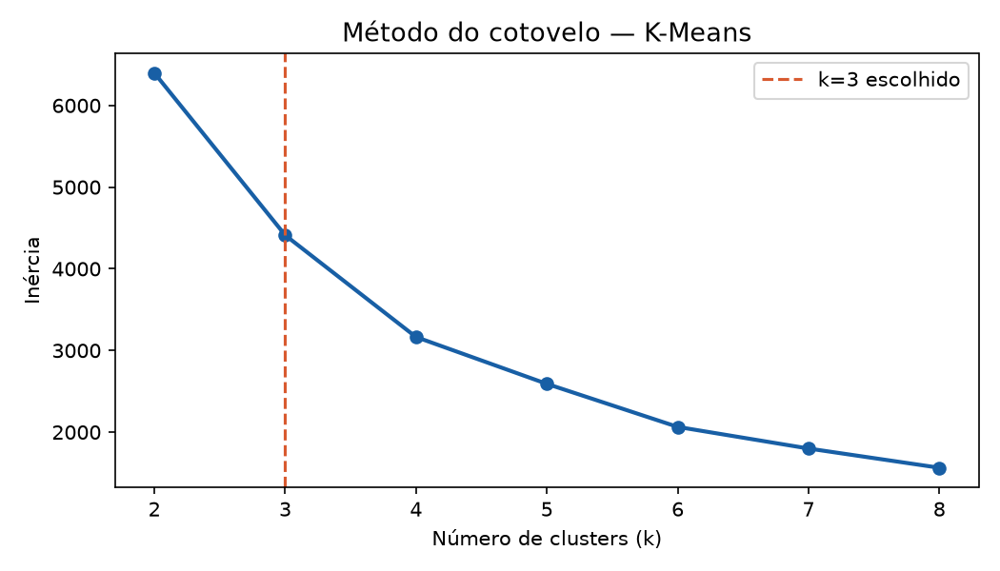

# Análise de Desempenho Acadêmico em Curso EaD com Machine Learning

Projeto de análise exploratória e modelagem preditiva aplicado a dados reais
de um curso a distância ofertado pelo IFNMG durante a pandemia de COVID-19 (2020).

## Contexto

O curso de Programador de Dispositivos Móveis (PDM) foi ofertado em 2 edições
com cerca de 400 vagas cada, totalizando mais de 1.000 alunos. O objetivo do
projeto é identificar padrões de comportamento e prever aprovação/reprovação
com base nos dados de acesso à plataforma digital — sem utilizar as notas.

## Tecnologias

- Python 3.11
- Pandas
- Scikit-learn
- Matplotlib

## Estrutura do projeto
├── Visualizacao de dados.py   # análise exploratória e gráficos

├── Treinamento IA.py          # modelos de ML

├── assets/                    # imagens geradas

└── README.md

## O que foi feito

### Visualização de Dados

#### Aprovados e Reprovados por Disciplina

#### Distribuição de Notas por Disciplina

### Modelos de Classificação
Variável alvo: `Resultado` (APROVADO / REPROVADO)  
Variáveis descritivas: apenas dados de acesso à plataforma

| Modelo | Acurácia |
|--------|----------|
| Árvore de Decisão | 84% |
| Random Forest | 89% |

#### Matrizes de Confusão

#### Importância das Variáveis — Random Forest

### Modelos de Regressão
Variável alvo: `NotaTotal`  
Variáveis descritivas: apenas dados de acesso à plataforma

| Modelo | R² | RMSE |
|--------|----|------|
| Regressão Linear | -0.05 | 97.23 |
| Gradient Boosting | -0.12 | 100.54 |

#### Real vs Predito

#### Importância das Variáveis — Gradient Boosting

> **Limitação:** os modelos de regressão apresentaram R² negativo, indicando
> que os dados de acesso isoladamente não são suficientes para estimar a nota
> final com precisão. Isso reforça que o desempenho acadêmico depende de
> fatores além do engajamento na plataforma.

### Análise de Agrupamento
- Redução de dimensionalidade com PCA (44.5% da variância explicada)
- Agrupamento com K-Means (k=3)

| Cluster | Alunos | % Aprovados | Perfil |
|---------|--------|-------------|--------|
| 0 | 479 | 12.9% | Baixo engajamento |
| 1 | 306 | 84.6% | Alto desempenho |
| 2 | 232 | 77.2% | Intermediário |

#### Clusters — PCA + K-Means

#### Método do Cotovelo

## Principal descoberta

Alunos com maior engajamento nos fóruns tendem a ter notas mais altas.
O Random Forest com 89% de acurácia mostrou que é possível prever
a aprovação de um aluno com base apenas no seu comportamento de acesso
à plataforma — sem considerar as notas.

## Dados

Os dados são de alunos reais anonimizados, fornecidos pelo IFNMG.
O arquivo CSV não está disponível neste repositório por questões de privacidade.